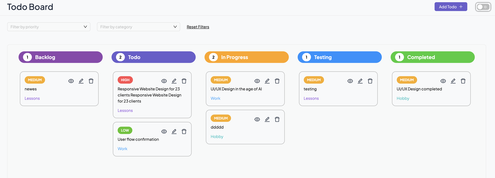
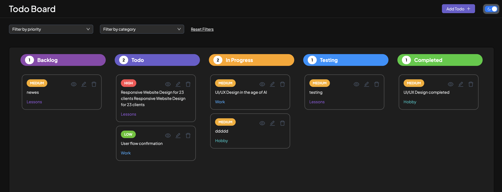

# Advanced Todo Board

An advanced Kanban-style Todo Board built with **React 19**, **Redux Toolkit**, **Ant Design**, and **dnd-kit**. It supports full drag-and-drop, filters, CRUD operations, persistent local storage, light/dark theme toggling, styled by Antd design tokens, responsive UI.




---

## Features

- **Light & Dark Mode Toggle**
- **Drag & Drop Functionality**
- Reorder todos and move them between columns using `@dnd-kit`
- **CRUD Operations**
  - Create, Read (Detail View), Update, and Delete Todos
- **Filtering**
- Filter tasks by priority and category
- **LocalStorage Persistence**
- All todos are saved locally — no backend required
- **Detailed View**
- Create and edit full task details in a modal
- **Modern Stack**
  - Built with Vite, React 19, and Redux Toolkit for high performance

---

## 🛠️ Tech Stack

- **React 19**
- **Redux Toolkit**
- **Ant Design 5**
- **React Router 7.6.0**
- **dnd-kit** (`core`, `sortable`, `utilities`, `modifiers`)
- **styled-components**
- **TypeScript**
- **Vite** (for blazing-fast dev environment)

---

## Installation

```bash
git clone https://github.com/LianaIlyichyova/advanced-todo-list
cd todo-list
npm install

npm run dev
```
